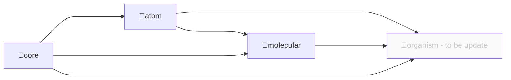

# 프로젝트 소개

## 설치 및 사용

### 설치

[npmjs](https://www.npmjs.com/) 공식 사이트 [@99mini/atomic-mini-component](https://www.npmjs.com/package/@99mini/atomic-mini-component) 를 방문하거나 터미널의 명령어를 실행합니다.

```bash
$ npm i @99mini/atomic-mini-component
```

`or`

```bash
$ yarn add @99mini/atomic-mini-component
```

### 사용

```javascript
// import from root directory
import { Button } from "@99mini/atomic-mini-component";

// import from package (atom, molecular, core, ...)
import { Textarea } from "@99mini/atomic-mini-component/atom";
import { Ripple } from "@99mini/atomic-mini-component/core";

/**
 * to be update
 * import from sub package
 */
// import Textarea from "@99mini/atomic-mini-component/atom/Textarea";
```

## 개발

### install dependency

```bash
$ npm install
```

`or`

```bash
$ yarn install
```

### 로컬

```bash
$ npm run storybook
```

### directory dependency



### 배포

```bash
$ npm login
$ yarn publish --access public
```

## 참고 블로그

1. [Rollup.js를 이용한 React 컴포넌트 라이브러리](https://blog.itcode.dev/projects/2022/06/10/react-components-library-starter#6.-storybook-%EC%84%A4%EC%B9%98)
