# 프로젝트 소개

## 설치 및 사용

### 설치

[npmjs](https://www.npmjs.com/) 공식 사이트 [@99mini/atomic-mini-component](https://www.npmjs.com/package/@99mini/atomic-mini-component) 를 방문하거나 터미널의 명령어를 실행합니다.

```bash
$ npm i @99mini/atomic-mini-component
```

`or`

```bash
$ yarn add @99mini/atomic-mini-component
```

### 사용

```javascript
// import from root directory
import { Button } from "@99mini/atomic-mini-component";

// import from package (atom, molecular, core, ...)
import { Textarea } from "@99mini/atomic-mini-component/atom";
import { Ripple } from "@99mini/atomic-mini-component/core";

/**
 * to be update
 * import from sub package
 */
// import Textarea from "@99mini/atomic-mini-component/atom/Textarea";
```

## 개발

### install dependency

```bash
$ npm install
```

`or`

```bash
$ yarn install
```

### 로컬

```bash
$ npm run storybook
```

### directory dependency

```mermaid
graph LR
    classDef toBeUpdated fill:#EBEBE445, color: #C6C6C6

    atom[📁atom] ----> molecular[📁molecular]

    atom & molecular ----> organism[📁organism - to be update]:::toBeUpdated

    core[📁core] ----> atom & molecular & organism
```

<svg id="diagram" width="100%" xmlns="http://www.w3.org/2000/svg" style="max-width: 1003.140625px;" viewBox="-48 -48 1003.140625 220" aria-roledescription="flowchart-v2" height="220" preserveAspectRatio="xMinYMin"><style>#diagram{font-family:"trebuchet ms",verdana,arial,sans-serif;font-size:16px;fill:#333;}#diagram .error-icon{fill:#552222;}#diagram .error-text{fill:#552222;stroke:#552222;}#diagram .edge-thickness-normal{stroke-width:2px;}#diagram .edge-thickness-thick{stroke-width:3.5px;}#diagram .edge-pattern-solid{stroke-dasharray:0;}#diagram .edge-pattern-dashed{stroke-dasharray:3;}#diagram .edge-pattern-dotted{stroke-dasharray:2;}#diagram .marker{fill:#333333;stroke:#333333;}#diagram .marker.cross{stroke:#333333;}#diagram svg{font-family:"trebuchet ms",verdana,arial,sans-serif;font-size:16px;}#diagram .label{font-family:"trebuchet ms",verdana,arial,sans-serif;color:#333;}#diagram .cluster-label text{fill:#333;}#diagram .cluster-label span,#diagram p{color:#333;}#diagram .label text,#diagram span,#diagram p{fill:#333;color:#333;}#diagram .node rect,#diagram .node circle,#diagram .node ellipse,#diagram .node polygon,#diagram .node path{fill:#ECECFF;stroke:#9370DB;stroke-width:1px;}#diagram .flowchart-label text{text-anchor:middle;}#diagram .node .katex path{fill:#000;stroke:#000;stroke-width:1px;}#diagram .node .label{text-align:center;}#diagram .node.clickable{cursor:pointer;}#diagram .arrowheadPath{fill:#333333;}#diagram .edgePath .path{stroke:#333333;stroke-width:2.0px;}#diagram .flowchart-link{stroke:#333333;fill:none;}#diagram .edgeLabel{background-color:#e8e8e8;text-align:center;}#diagram .edgeLabel rect{opacity:0.5;background-color:#e8e8e8;fill:#e8e8e8;}#diagram .labelBkg{background-color:rgba(232, 232, 232, 0.5);}#diagram .cluster rect{fill:#ffffde;stroke:#aaaa33;stroke-width:1px;}#diagram .cluster text{fill:#333;}#diagram .cluster span,#diagram p{color:#333;}#diagram div.mermaidTooltip{position:absolute;text-align:center;max-width:200px;padding:2px;font-family:"trebuchet ms",verdana,arial,sans-serif;font-size:12px;background:hsl(80, 100%, 96.2745098039%);border:1px solid #aaaa33;border-radius:2px;pointer-events:none;z-index:100;}#diagram .flowchartTitleText{text-anchor:middle;font-size:18px;fill:#333;}#diagram :root{--mermaid-font-family:"trebuchet ms",verdana,arial,sans-serif;}#diagram .toBeUpdated&gt;\*{fill:#EBEBE445!important;color:#C6C6C6!important;}#diagram .toBeUpdated span{fill:#EBEBE445!important;color:#C6C6C6!important;}#diagram .toBeUpdated tspan{fill:#C6C6C6!important;}</style><g><marker id="diagram_flowchart-pointEnd" class="marker flowchart" viewBox="0 0 10 10" refX="6" refY="5" markerUnits="userSpaceOnUse" markerWidth="12" markerHeight="12" orient="auto"><path d="M 0 0 L 10 5 L 0 10 z" class="arrowMarkerPath" style="stroke-width: 1; stroke-dasharray: 1, 0;"></path></marker><marker id="diagram_flowchart-pointStart" class="marker flowchart" viewBox="0 0 10 10" refX="4.5" refY="5" markerUnits="userSpaceOnUse" markerWidth="12" markerHeight="12" orient="auto"><path d="M 0 5 L 10 10 L 10 0 z" class="arrowMarkerPath" style="stroke-width: 1; stroke-dasharray: 1, 0;"></path></marker><marker id="diagram_flowchart-circleEnd" class="marker flowchart" viewBox="0 0 10 10" refX="11" refY="5" markerUnits="userSpaceOnUse" markerWidth="11" markerHeight="11" orient="auto"><circle cx="5" cy="5" r="5" class="arrowMarkerPath" style="stroke-width: 1; stroke-dasharray: 1, 0;"></circle></marker><marker id="diagram_flowchart-circleStart" class="marker flowchart" viewBox="0 0 10 10" refX="-1" refY="5" markerUnits="userSpaceOnUse" markerWidth="11" markerHeight="11" orient="auto"><circle cx="5" cy="5" r="5" class="arrowMarkerPath" style="stroke-width: 1; stroke-dasharray: 1, 0;"></circle></marker><marker id="diagram_flowchart-crossEnd" class="marker cross flowchart" viewBox="0 0 11 11" refX="12" refY="5.2" markerUnits="userSpaceOnUse" markerWidth="11" markerHeight="11" orient="auto"><path d="M 1,1 l 9,9 M 10,1 l -9,9" class="arrowMarkerPath" style="stroke-width: 2; stroke-dasharray: 1, 0;"></path></marker><marker id="diagram_flowchart-crossStart" class="marker cross flowchart" viewBox="0 0 11 11" refX="-1" refY="5.2" markerUnits="userSpaceOnUse" markerWidth="11" markerHeight="11" orient="auto"><path d="M 1,1 l 9,9 M 10,1 l -9,9" class="arrowMarkerPath" style="stroke-width: 2; stroke-dasharray: 1, 0;"></path></marker><g class="root"><g class="clusters"></g><g class="edgePaths"><path d="M290.906,33.73L295.073,35.525C299.24,37.32,307.573,40.91,315.906,42.705C324.24,44.5,332.573,44.5,340.906,44.5C349.24,44.5,357.573,44.5,365.906,44.5C374.24,44.5,382.573,44.5,390.906,44.5C399.24,44.5,407.573,44.5,415.118,45.635C422.664,46.771,429.422,49.041,432.8,50.177L436.179,51.312" id="L-atom-molecular-0" class="edge-thickness-normal edge-pattern-solid flowchart-link LS-atom LE-molecular" style="fill:none;" marker-end="url(#diagram_flowchart-pointEnd)"></path><path d="M290.906,12.064L295.073,11.387C299.24,10.709,307.573,9.355,315.906,8.677C324.24,8,332.573,8,340.906,8C349.24,8,357.573,8,365.906,8C374.24,8,382.573,8,390.906,8C399.24,8,407.573,8,424.884,8C442.195,8,468.484,8,494.773,8C521.063,8,547.352,8,564.663,8C581.974,8,590.307,8,598.641,8C606.974,8,615.307,8,623.641,8C631.974,8,640.307,8,648.641,8C656.974,8,665.307,8,684.067,15.113C702.826,22.226,732.012,36.452,746.605,43.565L761.198,50.678" id="L-atom-organism-0" class="edge-thickness-normal edge-pattern-solid flowchart-link LS-atom LE-organism" style="fill:none;" marker-end="url(#diagram_flowchart-pointEnd)"></path><path d="M548.641,71L552.807,71C556.974,71,565.307,71,573.641,71C581.974,71,590.307,71,598.641,71C606.974,71,615.307,71,623.641,71C631.974,71,640.307,71,648.641,71C656.974,71,665.307,71,672.757,71C680.207,71,686.774,71,690.057,71L693.341,71" id="L-molecular-organism-0" class="edge-thickness-normal edge-pattern-solid flowchart-link LS-molecular LE-organism" style="fill:none;" marker-end="url(#diagram_flowchart-pointEnd)"></path><path d="M49.202,69.5L56.481,60.917C63.76,52.333,78.317,35.167,89.763,26.583C101.208,18,109.542,18,117.875,18C126.208,18,134.542,18,142.875,18C151.208,18,159.542,18,167.875,18C176.208,18,184.542,18,191.992,18C199.442,18,206.008,18,209.292,18L212.575,18" id="L-core-atom-0" class="edge-thickness-normal edge-pattern-solid flowchart-link LS-core LE-atom" style="fill:none;" marker-end="url(#diagram_flowchart-pointEnd)"></path><path d="M67.875,87.5L72.042,87.5C76.208,87.5,84.542,87.5,92.875,87.5C101.208,87.5,109.542,87.5,117.875,87.5C126.208,87.5,134.542,87.5,142.875,87.5C151.208,87.5,159.542,87.5,167.875,87.5C176.208,87.5,184.542,87.5,198.961,87.5C213.38,87.5,233.885,87.5,254.391,87.5C274.896,87.5,295.401,87.5,309.82,87.5C324.24,87.5,332.573,87.5,340.906,87.5C349.24,87.5,357.573,87.5,365.906,87.5C374.24,87.5,382.573,87.5,390.906,87.5C399.24,87.5,407.573,87.5,415.042,86.809C422.51,86.118,429.114,84.737,432.417,84.046L435.719,83.355" id="L-core-molecular-0" class="edge-thickness-normal edge-pattern-solid flowchart-link LS-core LE-molecular" style="fill:none;" marker-end="url(#diagram_flowchart-pointEnd)"></path><path d="M63.003,105.5L67.981,108.583C72.96,111.667,82.918,117.833,92.063,120.917C101.208,124,109.542,124,117.875,124C126.208,124,134.542,124,142.875,124C151.208,124,159.542,124,167.875,124C176.208,124,184.542,124,198.961,124C213.38,124,233.885,124,254.391,124C274.896,124,295.401,124,309.82,124C324.24,124,332.573,124,340.906,124C349.24,124,357.573,124,365.906,124C374.24,124,382.573,124,390.906,124C399.24,124,407.573,124,424.884,124C442.195,124,468.484,124,494.773,124C521.063,124,547.352,124,564.663,124C581.974,124,590.307,124,598.641,124C606.974,124,615.307,124,623.641,124C631.974,124,640.307,124,648.641,124C656.974,124,665.307,124,682.882,118.502C700.457,113.004,727.274,102.007,740.682,96.509L754.091,91.011" id="L-core-organism-0" class="edge-thickness-normal edge-pattern-solid flowchart-link LS-core LE-organism" style="fill:none;" marker-end="url(#diagram_flowchart-pointEnd)"></path></g><g class="edgeLabels"><g class="edgeLabel"><g class="label" transform="translate(0, 0)"><foreignObject width="0" height="0"><div xmlns="http://www.w3.org/1999/xhtml" style="display: inline-block; white-space: nowrap;"><span class="edgeLabel"></span></div></foreignObject></g></g><g class="edgeLabel"><g class="label" transform="translate(0, 0)"><foreignObject width="0" height="0"><div xmlns="http://www.w3.org/1999/xhtml" style="display: inline-block; white-space: nowrap;"><span class="edgeLabel"></span></div></foreignObject></g></g><g class="edgeLabel"><g class="label" transform="translate(0, 0)"><foreignObject width="0" height="0"><div xmlns="http://www.w3.org/1999/xhtml" style="display: inline-block; white-space: nowrap;"><span class="edgeLabel"></span></div></foreignObject></g></g><g class="edgeLabel"><g class="label" transform="translate(0, 0)"><foreignObject width="0" height="0"><div xmlns="http://www.w3.org/1999/xhtml" style="display: inline-block; white-space: nowrap;"><span class="edgeLabel"></span></div></foreignObject></g></g><g class="edgeLabel"><g class="label" transform="translate(0, 0)"><foreignObject width="0" height="0"><div xmlns="http://www.w3.org/1999/xhtml" style="display: inline-block; white-space: nowrap;"><span class="edgeLabel"></span></div></foreignObject></g></g><g class="edgeLabel"><g class="label" transform="translate(0, 0)"><foreignObject width="0" height="0"><div xmlns="http://www.w3.org/1999/xhtml" style="display: inline-block; white-space: nowrap;"><span class="edgeLabel"></span></div></foreignObject></g></g></g><g class="nodes"><g class="node default default flowchart-label" id="flowchart-atom-27" data-node="true" data-id="atom" transform="translate(254.390625, 18)"><rect class="basic label-container" style="" rx="0" ry="0" x="-36.515625" y="-18" width="73.03125" height="36"></rect><g class="label" style="" transform="translate(-29.015625, -10.5)"><rect></rect><foreignObject width="58.03125" height="21"><div xmlns="http://www.w3.org/1999/xhtml" style="display: inline-block; white-space: nowrap;"><span class="nodeLabel">📁atom</span></div></foreignObject></g></g><g class="node default default flowchart-label" id="flowchart-molecular-28" data-node="true" data-id="molecular" transform="translate(494.7734375, 71)"><rect class="basic label-container" style="" rx="0" ry="0" x="-53.8671875" y="-18" width="107.734375" height="36"></rect><g class="label" style="" transform="translate(-46.3671875, -10.5)"><rect></rect><foreignObject width="92.734375" height="21"><div xmlns="http://www.w3.org/1999/xhtml" style="display: inline-block; white-space: nowrap;"><span class="nodeLabel">📁molecular</span></div></foreignObject></g></g><g class="node default toBeUpdated flowchart-label" id="flowchart-organism-31" data-node="true" data-id="organism" transform="translate(802.890625, 71)"><rect class="basic label-container" style="" rx="0" ry="0" x="-104.25" y="-18" width="208.5" height="36"></rect><g class="label" style="" transform="translate(-96.75, -10.5)"><rect></rect><foreignObject width="193.5" height="21"><div xmlns="http://www.w3.org/1999/xhtml" style="display: inline-block; white-space: nowrap;"><span class="nodeLabel">📁organism - to be update</span></div></foreignObject></g></g><g class="node default default flowchart-label" id="flowchart-core-32" data-node="true" data-id="core" transform="translate(33.9375, 87.5)"><rect class="basic label-container" style="" rx="0" ry="0" x="-33.9375" y="-18" width="67.875" height="36"></rect><g class="label" style="" transform="translate(-26.4375, -10.5)"><rect></rect><foreignObject width="52.875" height="21"><div xmlns="http://www.w3.org/1999/xhtml" style="display: inline-block; white-space: nowrap;"><span class="nodeLabel">📁core</span></div></foreignObject></g></g></g></g></g></svg>



### generate boilerplate

```bash
$ scripts/_generate_boilerplate.sh <core | atom | molecular> <Filename>
```

### 배포

```bash
$ npm login
$ yarn publish --access public
```

## 참고 블로그

1. [Rollup.js를 이용한 React 컴포넌트 라이브러리](https://blog.itcode.dev/projects/2022/06/10/react-components-library-starter#6.-storybook-%EC%84%A4%EC%B9%98)
