# 프로젝트 소개

## 설치 및 사용

1. [@99mini/utils](https://github.com/99mini/frontend-libraries/blob/main/packages/utils/README.md)
2. [@99mini/core](https://github.com/99mini/frontend-libraries/blob/main/packages/core/README.md)
3. [@99mini/atom](https://github.com/99mini/frontend-libraries/blob/main/packages/atom/README.md)
4. [@99mini/molecular](https://github.com/99mini/frontend-libraries/blob/main/packages/molecular/README.md)
5. [@99mini/yni-ui](https://github.com/99mini/frontend-libraries/blob/main/packages/yni-ui/README.md)

## 개발

### 개발 환경

- node v18
- ubuntu v20

### install dependency

```bash
$ npm install
```

`or`

```bash
$ yarn
```

### 로컬

```bash
$ npm run storybook
```

### directory dependency

```mermaid
graph LR
    classDef toBeUpdated fill:#EBEBE445, color: #C6C6C6


    atom[📁atom] ----> molecular[📁molecular]

    core[📁core] ----> atom & molecular & organism

    utils[📁utils] ----> atom & core

    atom & molecular & core ----> yni-ui[📁yni-ui]

    atom & molecular ----> organism[📁organism - to be update]:::toBeUpdated


```



### generate component boilerplate

`gcb` is an abbreviation for generate component boilerplate

```bash
$ scripts/gcb.sh <core | atom | molecular | yni-ui | utils> <Filename>
```

### 배포

```bash
$ npm login
$ yarn publish --access public
```
