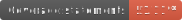
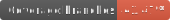

<div>
  
  
  
  
</div>

# Install

```bash
$ yarn add @99mini/calendar
```

# Usage

## import

import from `@99mini/calendar` or `@99mini/calendar/<component>`. You can do a default import using `calendar/<component>`.

```tsx
import { SingleCalendar } from "@99mini/calendar";
import SingleCalendar from "@99mini/calendar/SingleCalendar";
```

## SingleCalendar

### Default

```tsx
import SingleCalendar from "@99mini/calendar/SingleCalendar";

const App = () => {
  return <SingleCalendar year={2024} month={6} />;
};
```

### readonly

```tsx
import SingleCalendar from "@99mini/calendar/SingleCalendar";

const App = () => {
  return <SingleCalendar year={2024} month={6} readonly />;
};
```

# Dependency

[@99mini/atom](https://www.npmjs.com/package/@99mini/atom)
[@99mini/molecular](https://www.npmjs.com/package/@99mini/molecular)
[@99mini/core](https://www.npmjs.com/package/@99mini/core)
